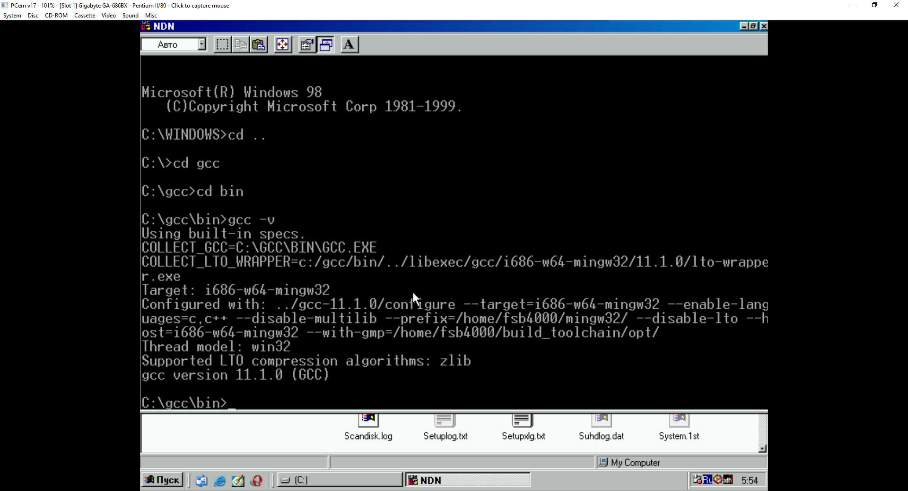
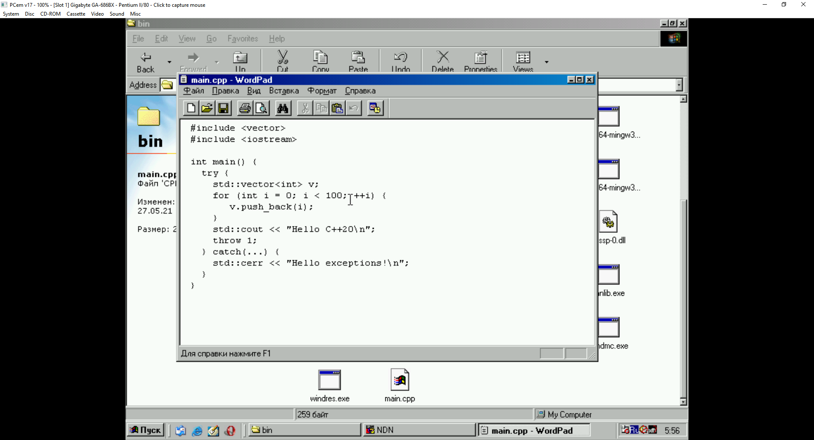
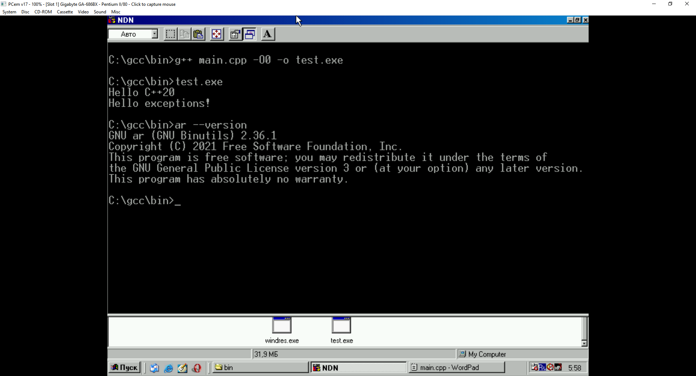

# gcc-for-Windows98
I managed to build gcc 11.1.0 for Windows 98 :)

binutils, gmp, mpfr, mpc: no additional patches needed. :)

mingw-w64:
1) Apply the commit: https://github.com/mirror/mingw-w64/commit/8da1aae7a7ff5bf996878dc8fe30a0e01e210e5a#diff-6ea4503f203d411ce2acce0fa56a61643c1bd33ae96180d9cbff88b7aef5d9a5
2) Revert the commit: https://github.com/mirror/mingw-w64/commit/4d3b28a9929ea58511e7165cb7eb1bcdd01151ad#diff-9618c4c1bea3566e9e27613c3954997a9d44fef1a0dfbfc46227272d82062c2e
3) Apply the commit: https://github.com/mirror/mingw-w64/commit/660e09f3cb20f181b6d6435cb623d65a3922a063
4) Add define _USE_32BIT_TIME_T to configure: 
```console
../mingw-w64/configure --disable-nls CFLAGS="-D_USE_32BIT_TIME_T -O3" --target=i686-w64-mingw32  --prefix=/c/Dev/mingw32/i686-w64-mingw32
```

gcc:
1) Revert the commit: https://github.com/gcc-mirror/gcc/commit/1ed3ba0549f544bd9dd5195d7045b20dec0354a3#diff-2e680268e47fa6cc9b09ad5344d37e2cc443b766362a01eb7f73300cd5328fe9
2) Disable LFS: https://github.com/gcc-mirror/gcc/blob/ad0a3be4df5eecc79075d899fd79179d0f61270e/libstdc%2B%2B-v3/config.h.in#L932-L933
3) Disable aligned malloc: https://github.com/gcc-mirror/gcc/blob/16e2427f50c208dfe07d07f18009969502c25dc8/libstdc%2B%2B-v3/config.h.in#L571-L572
4) Disable aligned alloc: https://github.com/gcc-mirror/gcc/blob/ad0a3be4df5eecc79075d899fd79179d0f61270e/libstdc%2B%2B-v3/config.h.in#L9-L10
5) Comment out the line: https://github.com/gcc-mirror/gcc/blob/16e2427f50c208dfe07d07f18009969502c25dc8/libstdc%2B%2B-v3/include/experimental/bits/fs_path.h#L52
6) Comment out the line: https://github.com/gcc-mirror/gcc/blob/16e2427f50c208dfe07d07f18009969502c25dc8/libstdc%2B%2B-v3/include/bits/fs_path.h#L54
7) mingw-w64 mkdir doesn't accept mode:
https://github.com/gcc-mirror/gcc/blob/b7210405ed8eb5fd723b2c99960dcc5f0aec89b4/libstdc%2B%2B-v3/src/c%2B%2B17/fs_ops.cc#L582
and
https://github.com/gcc-mirror/gcc/blob/b7210405ed8eb5fd723b2c99960dcc5f0aec89b4/libstdc%2B%2B-v3/src/filesystem/ops.cc#L482




